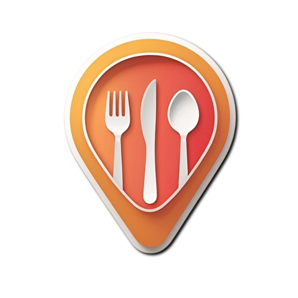

<div align="center">

  

  <p>
    <strong>A modern, beautiful restaurant discovery and review application.</strong>
  </p>

  <p>
    <a href="https://expo.dev/">
      
    </a>
    <a href="https://reactnative.dev/">
      
    </a>
    <a href="https://www.typescriptlang.org/">
      
    </a>
  </p>

  <p>
    <a href="#-features">Features</a> •
    <a href="#-tech-stack">Tech Stack</a> •
    <a href="#-getting-started">Getting Started</a> •
    <a href="#-screenshots">Screenshots</a> •
    <a href="#-contributing">Contributing</a>
  </p>

  <br />

</div>

---

## 📖 Overview

**FoodPin** is a premium mobile application designed to help users discover the best places to eat. With a sleek, glassmorphism-inspired UI and smooth animations, it offers a delightful user experience for finding restaurants, viewing details, and managing favorites.

## ✨ Features

| Feature | Description |
| :--- | :--- |
| **🔐 Authentication** | Secure Login and Signup with JWT and secure storage. |
| **🗺️ Interactive Maps** | Explore restaurants visually using Google Maps integration. |
| **🔍 Smart Search** | Real-time search by restaurant name or cuisine type. |
| **👤 User Profiles** | Personalized profile management and saved places. |
| **🌗 Dark/Light Mode** | Automatic theme switching based on system preferences. |
| **🎨 Modern UI** | Beautiful animations and a polished, responsive design. |

## 🛠 Tech Stack

<details>
  <summary><strong>Click to view detailed Tech Stack</strong></summary>
  <br />

  | Category | Technology | Description |
  | :--- | :--- | :--- |
  | **Core** | React Native | Cross-platform mobile framework |
  | **Platform** | Expo (SDK 52) | Development platform and tools |
  | **Language** | TypeScript | Static type checking |
  | **Navigation** | Expo Router | File-based routing system |
  | **Styling** | StyleSheet | Native styling with custom theme context |
  | **Animations** | Reanimated | High-performance animations |
  | **Maps** | React Native Maps | Map integration |
  | **Networking** | Axios | Promise-based HTTP client |
  | **Storage** | Secure Store | Encrypted local storage |

</details>

## 🚀 Getting Started

<details>
  <summary><strong>Installation & Setup Guide</strong></summary>
  <br />

  ### Prerequisites
  - [Node.js](https://nodejs.org/) (LTS)
  - [Expo Go](https://expo.dev/go) on your phone

  ### 1. Clone the repository
  ```bash
  git clone https://github.com/yourusername/foodpin.git
  cd foodpin
  ```

  ### 2. Install dependencies
  ```bash
  npm install
  ```

  ### 3. Configure Environment
  Create a `.env` file in the root:
  ```env
  EXPO_PUBLIC_GOOGLE_MAPS_API_KEY=your_api_key_here
  ```

  ### 4. Run the App
  ```bash
  npx expo start
  ```
  Scan the QR code with Expo Go to launch!

</details>

## 📱 Screenshots

<div align="center">
  <table>
    <tr>
      <td align="center">
        
        <br />
        <em>Login</em>
      </td>
      <td align="center">
        
        <br />
        <em>Home</em>
      </td>
      <td align="center">
        
        <br />
        <em>Map Search</em>
      </td>
    </tr>
    <tr>
      <td align="center">
        
        <br />
        <em>Details</em>
      </td>
      <td align="center">
        
        <br />
        <em>Profile</em>
      </td>
      <td align="center">
        
        <br />
        <em>Dark Mode</em>
      </td>
    </tr>
  </table>
</div>

## 📂 Project Structure

```
foodpin/
├── app/                 # 📱 Screens & Navigation
├── src/
│   ├── components/      # 🧩 Reusable UI Components
│   ├── constants/       # 🎨 Theme & Config
│   ├── context/         # 🧠 State Management
│   ├── services/        # 🌐 API Services
│   └── utils/           # 🛠 Helpers
└── assets/              # 🖼 Images & Fonts
```

## 🤝 Contributing

Contributions are welcome! Feel free to submit a Pull Request.

## 📄 License

This project is licensed under the MIT License.

---

<div align="center">
  <p>Made with ❤️ by the FoodPin Team</p>
  <p>
    <a href="https://github.com/yourusername/foodpin/stargazers">
      
    </a>
  </p>
</div>
